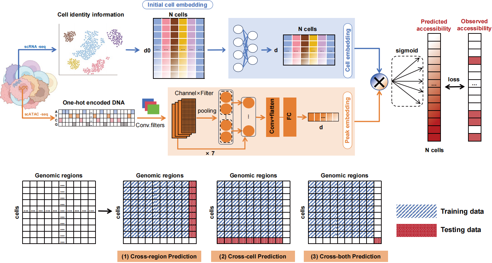

# **XChrom：a cross-cell chromatin accessibility prediction model integrating genomic sequences and cellular context**

<div align=left></div>

## **Brief Introduction**

**XChrom** is a multimodal deep learning framework for genome-wide cross-cell chromatin accessibility prediction that integrates genomic sequence and single-cell transcriptomics-derived cell identity into a unified model. Specifically, XChrom employs a convolutional neural network (CNN) architecture to model **DNA sequences**, effectively capturing the regulatory information encoded in DNA, while simultaneously incorporating **cell identity information** represented as low-dimensional cell embeddings derived from scRNA-seq data to achieve generalization at the single-cell level. As a result, the model takes two distinct inputs:  

1. **A sequence encoding module using CNNs**
This module takes 1344-bp genomic sequence centered around each peak from scATAC-seq data as input. After one-hot encoding, the sequence is processed through seven convolutional blocks, each containing a one-dimensional convolutional layer, a batch normalization layer, a max pooling layer, and a Gaussian error linear unit (GELU) activation function. Finally, an additional convolutional layer and a fully connected layer convert each input sequence into a 32-dimensional peak embedding.

2. **A cell identity encoding module**
This module extracts cell embedding matrix from paired scRNA-seq data. It takes an initial cell embedding matrix derived from raw scRNA-seq data as input, such as that from principal component analysis (PCA) Following Z-score normalization and layer normalization, the initial cell embedding matrix is transformed through two fully connected layers, producing a final 32-dimensional cell embedding matrix.

The peak embedding and cell embedding matrix are integrated via matrix multiplication, generating predicted chromatin accessibility probabilities for a given genomic sequence across all cells. This framework enables predicting chromatin accessibility probabilities for any genomic sequence in cells that are similar but not identical to those in the training set, and it can further facilitate the exploration of epigenetic regulation in development and disease directly from transcriptomic data.

## **Tutorial**

https://xchrom.readthedocs.io/en/latest/

## **Installation**

XChrom is a deep learning project developed with TensorFlow 2.6.0 and Python 3.8, requiring GPU acceleration support. This documentation provides complete installation and configuration instructions.

If you haven't installed conda yet, please download and install Miniconda or Anaconda first.

### 1. Create and Activate Conda Environment

```bash
# Create a Python 3.8 environment named XChrom
conda create -n XChrom python=3.8

# Activate the environment
conda activate XChrom
```

### 2. Install Git and Clone the Project

```bash
# Install Git
conda install git

# Clone the project
git clone https://github.com/Miaoyuanyuan777/XChrom.git
```

### 3. Install TensorFlow GPU Version

Two installation methods are available:

**Method 1: Install with conda**

```bash
conda install tensorflow-gpu=2.6.0 -c conda-forge
```

**Method 2: Install with pip**

```bash
pip install tensorflow-gpu==2.6.0
```

### 4. Install CUDA and cuDNN

```bash
# Install CUDA 11.2 and cuDNN 8.1
conda install cudatoolkit=11.2 cudnn=8.1 -c conda-forge
```

After installation, run the following command to verify that TensorFlow can correctly recognize the GPU:

```python
python -c "import tensorflow as tf; print(tf.__version__); print(tf.config.list_physical_devices('GPU'))"
```

If the output shows TensorFlow version 2.6.0 and detects GPU devices, the installation was successful.

### 5. Install Project Dependencies

```bash
# Navigate to the project directory
cd XChrom/

# Install all dependencies listed in requirements.txt
pip install -r requirements.txt

# Install XChrom
pip install .
```

## **Quick start**
```python
import xchrom as xc

data_path = xc.get_data_dir()
history = xc.tr.train_XChrom(
    input_folder = f'{data_path}/train_data',
    cell_embedding_ad = f'{data_path}/test_rna.h5ad',
    cellembed_raw='X_pca',
    out_path='./data/quick_start/train_out/',
    epochs = 10,
    verbose = 1
)

xc.pl.plot_train_history(
    history = history['history'],
    savefig = True,
    out_file = './data/quick_start/train_out/train_history_plot.pdf'
    )
```
