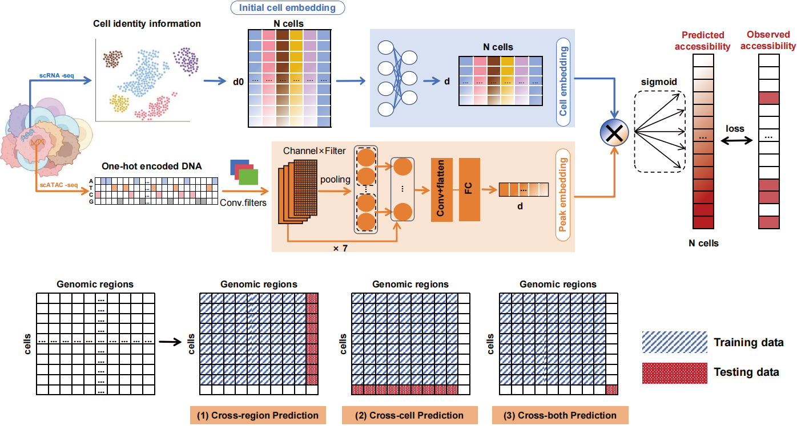

.. XChrom documentation master file, created by
   sphinx-quickstart on Wed Jul 23 19:16:06 2025.
   You can adapt this file completely to your liking, but it should at least
   contain the root `toctree` directive.

XChrom: a cross-cell chromatin accessibility prediction model integrating genomic sequences and cellular context.
==================================

**XChrom** is a multimodal deep learning framework for genome-wide cross-cell chromatin accessibility prediction that integrates genomic sequence and single-cell transcriptomics-derived cell identity into a unified model. Specifically, XChrom employs a convolutional neural network (CNN) architecture to model **DNA sequences**, effectively capturing the regulatory information encoded in DNA, while simultaneously incorporating **cell identity information** represented as low-dimensional cell embeddings derived from scRNA-seq data to achieve generalization at the single-cell level. As a result, the model takes two distinct inputs:  

1. **A sequence encoding module using CNNs**
This module takes 1344-bp genomic sequence centered around each peak from scATAC-seq data as input. After one-hot encoding, the sequence is processed through seven convolutional blocks, each containing a one-dimensional convolutional layer, a batch normalization layer, a max pooling layer, and a Gaussian error linear unit (GELU) activation function. Finally, an additional convolutional layer and a fully connected layer convert each input sequence into a 32-dimensional peak embedding.

2. **A cell identity encoding module**
This module extracts cell embedding matrix from paired scRNA-seq data. It takes an initial cell embedding matrix derived from raw scRNA-seq data as input, such as that from principal component analysis (PCA) Following Z-score normalization and layer normalization, the initial cell embedding matrix is transformed through two fully connected layers, producing a final 32-dimensional cell embedding matrix.

The peak embedding and cell embedding matrix are integrated via matrix multiplication , generating predicted chromatin accessibility probabilities for a given genomic sequence across all cells. This framework enables predicting chromatin accessibility probabilities for any genomic sequence in cells that are similar but not identical to those in the training set, and it can further facilitate the exploration of epigenetic regulation in development and disease directly from transcriptomic data.

.. toctree::
   :maxdepth: 1
   :caption: Overview
   
   Installation
   Quickstart
   Files and directories
   
.. toctree::
   :maxdepth: 3
   :caption: Tutorials

   Tutorials/index

.. toctree::
   :maxdepth: 2
   :caption: API

   API  

Indices and tables
==================

* :ref:`genindex`
* :ref:`modindex`
* :ref:`search`
